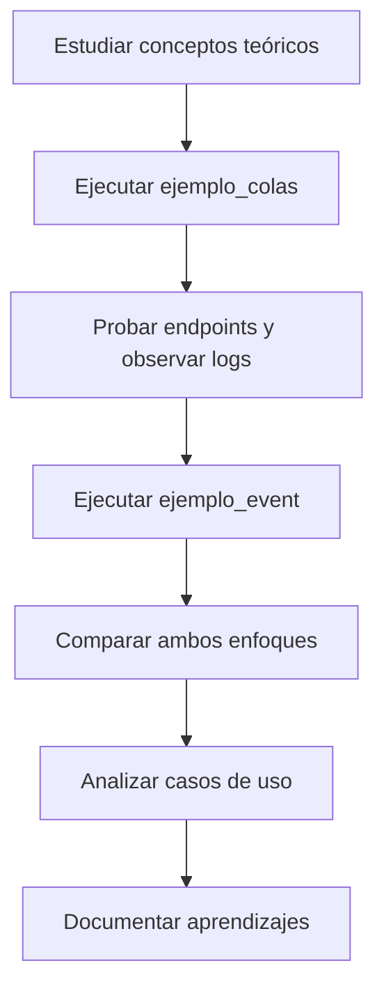

# Full Stack 3 - Patrones de Arquitectura de Software

Este repositorio contiene ejemplos prácticos de patrones de arquitectura de software implementados con Spring Boot y Java 17. Los proyectos demuestran conceptos fundamentales de arquitectura moderna y sistemas distribuidos.

## 📚 Proyectos Incluidos

### 1. **ejemplo_colas** - Colas de Mensajería con RabbitMQ
- **Arquitectura**: Productor → Cola → Consumidor
- **Tecnología**: Spring Boot + RabbitMQ + AMQP
- **Puerto**: 8081
- **Objetivo**: Enseñar el concepto básico de colas de mensajería

### 2. **ejemplo_event** - Arquitectura Basada en Eventos
- **Arquitectura**: Event-Driven Architecture (EDA)
- **Tecnología**: Spring Boot + Procesamiento Asíncrono
- **Puerto**: 8080
- **Objetivo**: Demostrar procesamiento asíncrono con eventos

## 🏗️ Patrones de Arquitectura Abordados

### 🔄 **Arquitectura de Colas de Mensajería**
Basado en el patrón **Message Queue** que permite:
- **Desacoplamiento** entre productores y consumidores
- **Comunicación asíncrona** entre servicios
- **Persistencia** de mensajes
- **Escalabilidad** horizontal

**Fluo básico:**
```
Cliente → API REST → Productor → Cola RabbitMQ → Consumidor
```

### ⚡ **Arquitectura Basada en Eventos**
Implementa el patrón **Event-Driven Architecture (EDA)**:
- **Publicación/Suscripción** de eventos
- **Procesamiento asíncrono** de tareas
- **Respuesta inmediata** con procesamiento en background
- **Gestión de estados** de tareas

**Flujo de eventos:**
```
Cliente → POST /api/tareas → 200 OK (inmediato)
                      ↓
               Publica evento
                      ↓
               Cola de eventos
                      ↓
            Consumidor procesa async
```

## 🎯 Material de Estudio

### 📖 **Fundamentos Teóricos**
Para entender los conceptos detrás de estos patrones de arquitectura, revisa la documentación sobre:
- Conceptos de arquitectura de software
- Patrones de mensajería y comunicación asíncrona
- Ventajas del desacoplamiento en sistemas distribuidos

### 🛠️ **Ejemplos Prácticos**
Cada proyecto incluye:
- **Código fuente completo** y documentado
- **Endpoints REST** para testing
- **Logs detallados** del flujo de ejecución
- **Postman Collections** para pruebas rápidas
- **README específico** con instrucciones detalladas

## 🚀 Guía de Estudio Sugerida

### Paso 1: Fundamentos Teóricos
1. **Estudiar conceptos básicos** de arquitectura de software:
   - Patrones de comunicación asíncrona
   - Principios de desacoplamiento
   - Ventajas de las colas de mensajería
   - Arquitectura basada en eventos

### Paso 2: Ejemplo Simple (Colas)
1. **Navegar a `ejemplo_colas`**
2. **Leer README.md** del proyecto
3. **Instalar RabbitMQ**:
   ```bash
   brew install rabbitmq
   brew services start rabbitmq
   ```
4. **Ejecutar el proyecto**:
   ```bash
   cd ejemplo_colas
   mvn spring-boot:run
   ```
5. **Probar los endpoints** con curl o Postman
6. **Observar los logs** del consumidor procesando mensajes

### Paso 3: Arquitectura de Eventos
1. **Navegar a `ejemplo_event`**
2. **Leer README.md** del proyecto
3. **Ejecutar el proyecto**:
   ```bash
   cd ejemplo_event
   mvn spring-boot:run
   ```
4. **Crear tareas asíncronas** y consultar su estado
5. **Comparar** con el ejemplo de colas

### Paso 4: Análisis Comparativo
1. **Identificar diferencias** entre ambos enfoques
2. **Analizar ventajas** de cada patrón
3. **Evaluar casos de uso** para cada arquitectura

## 🔍 Conceptos Clave Aprendidos

### ✅ **Desacoplamiento**
- Productores y consumidores son independientes
- Los servicios no necesitan conocerse mutuamente
- Facilita el mantenimiento y evolución

### ✅ **Asíncronismo**
- Respuestas inmediatas al cliente
- Procesamiento en background
- Mejor experiencia de usuario

### ✅ **Resiliencia**
- La cola persiste los mensajes
- Recuperación automática de fallos
- Sistema más robusto y tolerante

### ✅ **Escalabilidad**
- Múltiples consumidores pueden procesar
- Fácil agregar capacidad horizontal
- Distribución de carga automática

## 🛠️ Requisitos Técnicos

### Comunes para ambos proyectos:
- **Java 17+**
- **Maven 3.6+**
- **IDE**: IntelliJ IDEA, VS Code o Eclipse

### Específicos:
- **ejemplo_colas**: RabbitMQ instalado localmente
- **ejemplo_event**: Solo Spring Boot (procesamiento en memoria)

## 📱 Herramientas de Testing

### Postman Collections
Cada proyecto incluye una colección de Postman:
- **Endpoints preconfigurados**
- **Ejemplos de request/response**
- **Pruebas rápidas sin curl**

### RabbitMQ Management UI
- **URL**: http://localhost:15672
- **Usuario/Clave**: guest/guest
- **Funcionalidad**: Visualizar colas, mensajes y estadísticas

## 🎓 Objetivos de Aprendizaje

Al completar estos ejemplos, entenderás:

1. **Patrones de arquitectura** modernos
2. **Comunicación asíncrona** entre microservicios
3. **Desacoplamiento** de componentes
4. **Escalabilidad** de sistemas distribuidos
5. **Resiliencia** y tolerancia a fallos
6. **Mejores prácticas** con Spring Boot

## 🔄 Flujo de Trabajo Recomendado



## 📈 Próximos Pasos

Después de dominar estos conceptos:

1. **Implementar Dead Letter Queues**
2. **Agregar patrones Circuit Breaker**
3. **Explorar Kafka para streaming**
4. **Implementar sagas para transacciones distribuidas**
5. **Agregar monitoring y tracing**

---

**Autor**: Material educativo para Full Stack 3  
**Tecnologías**: Java 17, Spring Boot 3.2.5, RabbitMQ, Maven  
**Nivel**: Intermedio - Avanzado
